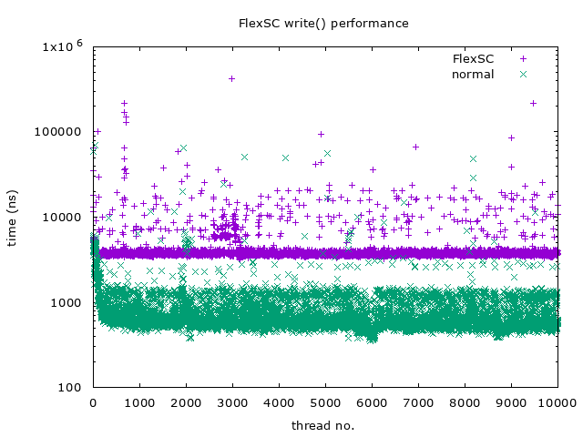

# Implementation of FlexSC on Linux Kernel v5.0+ and Performance Analysis

## FlexSC
FlexSC (Flexible System Call), a mechanism to executing system call, which was introduced on [OSDI'10](https://www.usenix.org/conference/osdi10/flexsc-flexible-system-call-scheduling-exception-less-system-calls) by Livio Soares.

The main concept of FlexSC is processing syscalls in batching way, which has better cache locality and almost no CPU mode switch involved. For more details, the link above has link to the paper. Also, you can refer to my porting note at [HackMD](https://hackmd.io/@flawless0714/S1Wdf-g0V).

## How Syscall Being Processed by FlexSC
Syscalls are processed through the following steps:

1. The moment syscall being requested by user thread, it simply grab a free syscall entry, and submit (change the state of the entry) it after done population of syscall-related arguments to the entry
2. Once there are no free entries, the kernel visible thread start submitting (by marking syscall entry to different state) the entries to kthread
3. Kthread detects that it got stuff to do (by scanning syscall entries), then it start queuing work to the CMWQ workqueue
4. After the work (syscall) is done, kthread change the state of the syscall entry
5. Library of FlexSC (user space) detects that the syscall is done, it simply return the retval of the syscall to application thread

The following is the illustration of FlexSC:
```
        |---------------------------|
        |                           |
        |   user thread requesting  | .....
        |          syscalls         |
        |                           |
        |---------------------------|

        |---------------------------|
        |                           |
        |   kernel-visible thread   |
        |                           |                   |-----------|
        |---------------------------|                   |           |
                                        USER SPACE      |  shared   |
--------------------------------------------------------|  syscall  | .....
                                       KERNEL SPACE     |   entry   |
        |---------------------------|                   |           |
        |                           |                   |-----------|
        |   kthreads dispatching    |
        |  work to CMWQ workqueue   |
        |                           |
        |---------------------------|
```

## Implementation
The repo was originally downloaded from splasky/flexsc ([c69213](https://github.com/splasky/linux/tree/c69213aabcb1b6046ade5dbacfc95d1d0356ea14)), it was lacking many of implementation of FlexSC at that commit, and what I've implemented are the following:

- per-kthread syscall entries
- kernel-visible thread (pthread)
- performance measurement program (write() and getpid() syscall)
- func of kthread
- mechanism to get free syscall entry
- allocation of CMWQ workqueue and work

## Analysis
The following results are done with 7 kthreads (kernel cpu) and 1 kernel-visible thread (user cpu) on 8th-gen Intel CPU (8350U) with HyperThreading enabled (4C8T).




### Conclusion
It's been 10 years since FlexSC released, computer organization may changed a lot (e.g. CPU mode switch in modern processor takes only <50ns within a round trip). Therefore, even FlexSC doesn't has better performance than typical syscall, this is still a record which shows that imporvements of cache locality and mode switch can't still beats the time cost of typical syscall. Or, there exists some overheads within my implementation of FlexSC, feel free to open a issue if you find out anything. Thank you!

## Acknowledgement
- @[afcidk](https://github.com/afcidk) - Discussing implementation of FlexSC
- @Livio Soares - Giving such concept to execute syscall
- @[splasky](https://github.com/splasky) - Providing prototype of FlexSC
- @[jserv](https://github.com/jserv) - Giving consultant of FlexSC
